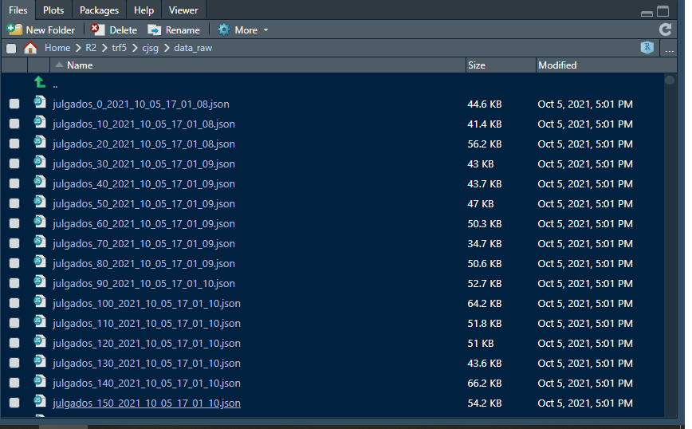

# **Apresentação**

Olá sou Marcello Filgueiras, faço Direito na UFJF (Universidade Federal de Juiz de Fora), e me interesso por Jurimetria. Minha ideia é baixar dados de tribunais para fazer pesquisa acadêmica, mas também estou tentando entrar com consultoria jurídica em mercado da jurimetria.

O objetivo desse scrapper é *baixar a jurisprudência*, o conjunto de *decisões* do TRF-5, o Tribunal Regional Federal do Nordeste, bem como a *consulta processual* de cada um dos processos específicos, que irá buscar *metadados do processo*, suas *partes* e as respectivas *movimentações*.

Portanto, são dois scrappers: Um do [buscador de jurisprudência](https://julia-pesquisa.trf5.jus.br/julia-pesquisa/#consulta), outro da [consulta processual](http://portal.trf5.jus.br/cp/).

Aqui estão os pacotes usados nesse processo.

```{r, echo=TRUE, message=FALSE, warning=FALSE}
knitr::opts_chunk$set(echo = TRUE)

#mais na primeira
library(tidyverse)
library(httr)
library(abjutils)
library(jsonlite)

#Mais a segunda
library(xml2)
library(rvest)
library(lubridate)

```


# **Buscador de Jurisprudência**

Trata-se de um [buscador de julgados](https://julia-pesquisa.trf5.jus.br/julia-pesquisa/#consulta) que vai te retornar _decisões dos tribunais_, a partir de uma pesquisa em _texto_, possibilitando de filtrar por _orgão julgador_, por _relator_ que redigiu o acórdão ou por período de _tempo_. Por fim, ainda, é possível buscar diretamente o julgado com o _número do processo específico_.


Apesar de parecer uma requisição POST, o site leva a uma API escondida que utiliza requisições GET. Os dados vêm em json, o que possibilita muito menos trabalho no parsing.

 
 


## **Acessando a API escondida**

Parece um POST por ser um formulário, mas leva a uma API que dá .json, por meio de um GET, que tem a seguinte URL base.

```{r}
url_base <- "https://julia-pesquisa.trf5.jus.br/julia-pesquisa/api/documentos:dt?"
```

### Teste Super Específico

Ao fazer uma pesquisa na Jurisprudência pelo texto de _"28,86%"_ em referência a uma tese consolidada sobre direito aumento de salários de professores federais no montante de 28,86%, do _Relator Alcides Saldanha Lima_, da _3ª Turma recursal_, num espaço de _10 anos_.

Nos headers, estes são os parâmetros que retornam do navegador:

 

Dentro da query, essa busca pode ser feita com {httr}.

```{r}
query_teste_especifico<- list(
  "draw" = "1",
  "columns[0][data]" = "codigoDocumento",
  "columns[0][name]" = "",
  "columns[0][searchable]" = "true",
  "columns[0][orderable]" = "false",
  "columns[0][search][value]" = "",
  "columns[0][search][regex]" = "false",
  "start" = "0",
  "length" = "10",
  "search[value]" = "",
  "search[regex]" = "false",
  "pesquisaLivre" = "28,86%",
  "numeroProcesso" = "",
  "orgaoJulgador" = "3ª TURMA",
  "relator" = "ALCIDES SALDANHA LIMA",
  "dataIni" = "01/01/2010",
  "dataFim" = "03/10/2021",
  "_" = "1633297312330")

teste_especifico <- httr::GET(url_base, 
                      query =query_teste_especifico)

# Vendo o resultado, temos um Json, com dados em Listas.

content(teste_especifico) %>%
  str(max=2)

```

Podemos ver então que, de início, conseguimos baixar todos os processos, com parâmetros bem definidos, nos seguintes parâmeteros:

Parâmetro | Dados Buscados
----------|----------------
"pesquisaLivre" | "28,86%",
"numeroProcesso" | "",
"orgaoJulgador" | "3? TURMA",
"relator" | "ALCIDES SALDANHA LIMA",
"dataIni" | "01/01/2010",
"dataFim" | "03/10/2021",


Esses _headers_ respondem, portanto, ao que colocamos no buscador. O que fazem os outros parâmetros, especialmente para paginação?

Poderíamos saber, mas essa busca retornou apenas um julgado. Vamos então para quantidades maiores de julgados, com uma requisição mais genérica.

Mas os dados estão dentro do elemento de nome "data".


### Teste Genérico

Nesse teste, procuramos somente pelo testo "28,86%":

```{r}
query_teste_generico <- list(
  "draw" = "1",
  "columns[0][data]" = "codigoDocumento",
  "columns[0][name]" = "",
  "columns[0][searchable]" = "true",
  "columns[0][orderable]" = "false",
  "columns[0][search][value]" = "",
  "columns[0][search][regex]" = "false",
  "start" = "0",
  "length" = "10",
  "search[value]" = "",
  "search[regex]" = "false",
  "pesquisaLivre" = "28,86%",
  "numeroProcesso" = "",
  "orgaoJulgador" = "",
  "relator" = "",
  "dataIni" = "",
  "dataFim" = "",
  "_" = "1633297312330")


teste_generico <- httr::GET(url_base, 
                              query = query_teste_generico)


content(teste_generico)%>%
  str(max=2)
```

Temos 9000 julgados, com 10 por página. Vamos então trocar de página para ver o que acontece:

 
 

 
 

 
 

Sabemos, portanto, que aumentando o parâmetro __start__, ele vai começar a exibir a partir dos próximos 10 julgados. Ele também registra no __draw__ qual número de páginas que você está (na verdade, quantas você trocou). Ao final um parâmetro **underline misterioso** que registra, ao que parece, o número de vezes que uma requisição foi pedida no site. Ele sobe progressivamente, mas se você acessa o site. Estamos chegando na forma de saber como a API funciona.

Última questão. Os parâmetro __draw__ e **underline misterioso** podem ser retirados?

O draw não pode ser retirado, retorna erro:

```{r}
 
 httr::GET(url_base,
      query = list(
  "columns[0][data]" = "codigoDocumento",
  "columns[0][name]" = "",
  "columns[0][searchable]" = "true",
  "columns[0][orderable]" = "false",
  "columns[0][search][value]" = "",
  "columns[0][search][regex]" = "false",
  "start" = "0",
  "length" = "10",
  "search[value]" = "",
  "search[regex]" = "false",
  "pesquisaLivre" = "28,86%",
  "numeroProcesso" = "",
  "orgaoJulgador" = "",
  "relator" = "",
  "dataIni" = "",
  "dataFim" = "",
  "_" = "1633297312330")) %>%
  content()

```


Mas o misterioso __underline__ com número pode sumir:

```{r}
 
 httr::GET(url_base,
      query = list(
  "draw" = "1",
  "columns[0][data]" = "codigoDocumento",
  "columns[0][name]" = "",
  "columns[0][searchable]" = "true",
  "columns[0][orderable]" = "false",
  "columns[0][search][value]" = "",
  "columns[0][search][regex]" = "false",
  "start" = "0",
  "length" = "10",
  "search[value]" = "",
  "search[regex]" = "false",
  "pesquisaLivre" = "28,86%",
  "numeroProcesso" = "",
  "orgaoJulgador" = "",
  "relator" = "",
  "dataIni" = "",
  "dataFim" = "")) %>%
  content() %>%
  str(max=2)

```

**Vamos então criar a função para baixar os dados!**


## **Baixando e Iterando**

Se temos 10 processos por página e um universo de 9000 julgados, é só iterar a função 900 vezes com __starts__ diferentes, 0, 10 e 20 e assim vai. O parâmetros __draw__ poderiam ser de 1, 2 e 3, mas só com o 1 funciona, acredito que sendo interpretado como a primeira página que você acessa, so que com o starts diferente. 

```{r}
trf5_baixar_cjsg <- function(pesquisa_livre = "", orgao_julgador = "",
                             relator = "", data_inicial = "", data_final = "",
                             diretorio = "") {
  # Vamos ter a url_base
  url_base <- "https://julia-pesquisa.trf5.jus.br/julia-pesquisa/api/documentos:dt?"
  
  # Vamos baixar a primeira página.
  query_1 = list(
    "draw" = "1",
    "columns[0][data]" = "codigoDocumento",
    "columns[0][name]" = "",
    "columns[0][searchable]" = "true",
    "columns[0][orderable]" = "false",
    "columns[0][search][value]" = "",
    "columns[0][search][regex]" = "false",
    "start" = "0",
    "length" = "10",
    "search[value]" = "",
    "search[regex]" = "false",
    "pesquisaLivre" = pesquisa_livre,
    "numeroProcesso" = "",
    "orgaoJulgador" = orgao_julgador,
    "relator" = relator,
    "dataIni" = data_inicial,
    "dataFim" = data_inicial)
  
  # Fazemos uma sequência de página  
 n_observacoes <- httr::GET(url_base,
            query= query_1) %>% 
             content() %>%
             pluck("recordsTotal")
   
  # Pegando o número de starts pela página
 n_starts <- seq(0,n_observacoes,10)
 
 # Fazendo o Map colocando o número de starts de character
 purrr::map(.x= n_starts,
            ~httr::GET(url_base,
                       query= list(
                         "draw" = "1",
                         "columns[0][data]" = "codigoDocumento",
                         "columns[0][name]" = "",
                         "columns[0][searchable]" = "true",
                         "columns[0][orderable]" = "false",
                         "columns[0][search][value]" = "",
                         "columns[0][search][regex]" = "false",
                         "start" = as.character(.x),
                         "length" = "10",
                         "search[value]" = "",
                         "search[regex]" = "false",
                         "pesquisaLivre" = pesquisa_livre,
                         "numeroProcesso" = "",
                         "orgaoJulgador" = orgao_julgador,
                         "relator" = relator,
                         "dataIni" = data_inicial,
                         "dataFim" = data_final),
          # Fazendo write_disk para salvar na minha pasta
          # nome da pasta é o numero do processo e a data da postagem.
            write_disk(path = paste0(diretorio, 
                                    "/",
                                   "julgados_",
                                  as.character(.x),
                                 "_",
                                Sys.time()%>%
                                 str_replace_all("\\D","_"),
                              ".json"))
            ))
           
 
}


```

Conseguimos! Essa função baixou os 9000 julgados, mas não rodar no markdown. 

trf5_baixar_cjsg(pesquisa_livre = "28,86%",
                 diretorio = "data_raw")
                 
 


## **Lendo e Iterando**


Baixados os julgados, vamos à leitura deles. Como são Json's limpos, não necessidade de parsing complicado.


Temos que fazer 3 coisas na função, um _purrr::map() que vai ler tudo.

1) Para criar _.x_ da função, vamos listar quais arquivos estão na pasta, o que foi feito com _base::list.files_.
2) Criar a barra de progresso com _progress::progress_bar_
3) Ler os Jsons

``` {r}
trf5_ler_cjsg <- function(diretorio= ""){
  
  #Listando os Arquivos
  arquivos <- base::list.files(paste0(diretorio,"/"),
                   pattern = "\\.json$", 
                   full.names = TRUE) 
  #Barra de Progresso
  barra_progresso <- progress::progress_bar $ new(total = length(arquivos))
  
  purrr::map_df( .x= arquivos,
                  .f = ~{
                    barra_progresso$tick()
                    #Lendo e selecionado a lista
                    jsonlite::fromJSON (.x, simplifyDataFrame = TRUE )%>%
                   purrr::pluck("data")
                    })
}


```


Vamos testar a função:


``` {r}
julgados_28_raw <- trf5_ler_cjsg(diretorio= "cjsg/data_raw") %>%
  janitor::clean_names()

julgados_28_raw%>%
  tibble::as_tibble()


```

Conseguimos! Lemos as bases e estão em um formato pronto para ser utilizado

## **Utilizando a Base**

No Escritório, o foco está em analisar o tempo que o processo demora. Assie, tentei analisar um tempo que a interposição recurso pode influenciar no julgamento, desde a sua autuação (registro no sistema) até seu julgamento.

### Tidying
Vamos ver a qualidade das bases.


Órgão Julgadores estão padronizados:

``` {r}

julgados_28_raw %>%
  count(orgao_julgador)

``` 


A Classe de cada Recurso não:

``` {r}

#A Classe de cada Recurso não
julgados_28_raw %>%
  count(classe_judicial) %>%
  as_tibble(max=20)
``` 


Vamos dar um tidying:
1) Passando datas para formato date.
2) padronizando classes. As que não foram usadas e coloquei "#" foi porque tinham número pequeno que não era muito significativo para a operação.


``` {r}

julgados_28_tidy <- julgados_28_raw %>%
  #Passando Formato Date
  mutate(across(.cols = c(data_autuacao, data_julgamento, data_assinatura),
                .fns = lubridate::ymd
                )
         ) %>%
  # Arrumando Duplicidade. os outros # no meio do case_when são categorias que,
  #apesar de serem duplicadas, estavam em baixo número e não era necessária sua apresentação
  mutate(classe_judicial_raw= abjutils::rm_accent(classe_judicial)%>%
                            str_to_lower(),
         classe_judicial= case_when(
           str_detect(classe_judicial_raw, "embargos de declaracao") ~ "Embargos de Declaração",
           #str_detect(classe_judicial_raw, "inominado|inonimado") ~ "Agravo Inominado",
           str_detect(classe_judicial_raw, "regimental") ~ "Agravo Regimental",
           #str_detect(classe_judicial_raw, "agravo n|agravo retido") ~ "Agravo",
           #str_detect(classe_judicial_raw, "agravo interno") ~ "Agravo Interno",
           str_detect(classe_judicial_raw, "agravo de instrumento") ~ "Agravo de Instrumento",
           str_detect(classe_judicial_raw, "remessa|reexame") ~ "Remessa Necessária",
           str_detect(classe_judicial_raw, "embargos a execucao") ~ "Embargos à Execução",
           #str_detect(classe_judicial_raw, "embargos infringentes") ~ "Embargos Infringentes",
           #str_detect(classe_judicial_raw, "divergencia") ~ "Embargos de Divergência",
           #str_detect(classe_judicial_raw, "questao de ordem") ~ "Questão de Ordem",
           #str_detect(classe_judicial_raw, "conflito") ~ "Conflito de Competência",
           str_detect(classe_judicial_raw, "^apelacao") ~ "Apelação",
           str_detect(classe_judicial_raw, "acao rescisoria") ~ "Ação Rescisória",
           TRUE ~ "Outros"
                                    ),
         # um formato date do ano do julgamento, para agrupar
         ano_julgamento= lubridate::year(data_julgamento),
         #aproveitei para fazer uma variável
         #tempo entre recurso e julgamento
         autuacao_julgamento = data_julgamento - data_autuacao
         )


```


Eliminei duplicidade nos assuntos. Tenho os assuntos mais reocrrentes, necessários para minha análise, de forma padronizada.


``` {r}

julgados_28_tidy %>%
  count(classe_judicial) 


```

Tenho as principais variáveis que quero, características dos processos que dividem o gurpo e principalmene o tempo.

``` {r}


julgados_28_tidy %>%
  #filter(classe_judicial == "Ação Rescisória") %>%
  select(numero_processo,
         classe_judicial,
         relator,
         orgao_julgador,
        # referencia,
         data_autuacao,
         data_julgamento,
         autuacao_julgamento,
         ementa
         ) %>%
  glimpse()


```

### Analisando Tempo e Ano


Esses vários tipos de julgados estão por diversos anos. Nesse ggplot abaixo:

Algo engraçdo é que a partir do novo CPC 2015, não existe mais o _agravo regimental_.
Foi substituído pelo agravo interno... Ainda assim, o número de agravos regimentais julgados depois de 2015 é enorme, demonstrando falha dos dados do tribunal.

```{r, echo=FALSE, message=FALSE, warning=FALSE}

julgados_28_tidy%>%
  #filter(ano_julgamento>2015) %>%
  group_by(ano_julgamento)%>%
  count(classe_judicial)%>%
  ggplot(aes(x=ano_julgamento, y=n, fill=classe_judicial)) +
  geom_col(color="black") +
  labs(title = "Número de Julgados por Ano que mencinonam \"28,86%\" no TRF-5",
       subtitle = "Dividos em Classe de Acórdãos") +
  scale_fill_discrete(name= "Classe de Acórdãos") +
  #scale_x_date(name= "Ano do Julgamento", date_breaks = "5 years")+
  xlab(label= "Ano do Julgamento") +
  scale_y_continuous(name= "Nº de Julgados")
```

Mas o que interessa aqui no meu escritório é a duração dos processos.Vamos então fazer umas contas sobre tempo e datas.

Eu preferi a mediana por ser o padrão ouro da ABJ, já que processos juidiciais tem muitos outliers de grandes números. Mas o pessoal do escritório pediu média e desvio padrão.

``` {r}


julgados_28_tidy %>% 
  group_by(classe_judicial) %>%
  summarise(mediana_julgamento = median(autuacao_julgamento, na.rm = TRUE),
            iqr_julgamento = IQR(autuacao_julgamento, na.rm = TRUE),
            media_julgamento = mean(autuacao_julgamento, na.rm = TRUE),
            desvio_pad_julgamento= sd(autuacao_julgamento, na.rm= TRUE)
            )

```


**Números são ruins.** Pessoal de humanas não entende...
Nós gostamos de gráficos! Vamos facetar todas essas classes entao.

```{r, echo=FALSE, message=FALSE, warning=FALSE}


tempo_julg<- julgados_28_tidy %>% 
  #contando
  group_by(classe_judicial ) %>%
  summarise(autuacao_julgamento) 

tempo_julg%>%
  filter(autuacao_julgamento <=10000) %>%
  #visualizando
  ggplot(aes(x= autuacao_julgamento)) +  
  geom_histogram( fill= "blue", color= "grey10") +
  facet_wrap( facets = vars(classe_judicial))+
  ylab(label= "Número de Processos") +
  xlab(label= "Número de Dias da Autuação do Recurso até Julgamento") +
  labs (title = "Efeito da Interposição do Recurso: Dias da sua Autuação até o Julgamento",
        subtitle = "9081 julgados que retornaram do TRF5 ao buscar por \"28,86%\" ")
```

O foco era nas ações rescisórias, perigosas ações que podem reverter uma ação já transitada em julgado, cuja "decisão é imodificável, transforma o redondo em quadrado", mas como tudo no Direito tem um _depende_, elas podiam foder a operação inteira de execuções de decisões já julgadas.

Estavam em voga nos corredores do escritório e fiz, portanto, o tempo médio até seu julgamentos:

```{r, echo=FALSE, message=FALSE, warning=FALSE}

tempo_julg %>% 
  filter(classe_judicial == "Ação Rescisória") %>% 
  ggplot(aes(x= autuacao_julgamento)) + 
  geom_histogram( fill= "blue", color= "black") + 
  ylab(label= "Número de Processos")+
  xlab(label= "Dias entre a Data de Julgamento e a Data de Autuação do Recurso") +
  scale_x_continuous(breaks = c(0,  180,  seq(365,6000, 365) ) ) +
    labs (title = "Efeito da Interposição do Recurso: Número de Dias da sua Autuação até o Julgamento",
        subtitle = "Nas Ações Rescisórias, a mediana desses números é de 495 dias, na linha de vermelho.\n A média, na linha verde, é de 600 dias.")+
  theme_update() +
  geom_vline(aes(xintercept = median(autuacao_julgamento, na.rm = TRUE)),col='red', size= 1.2) +
   geom_vline(aes(xintercept = mean(autuacao_julgamento, na.rm = TRUE)),col='green', size= 1.2)
```

**Esse foi então o scrapper de jurisprudência do TRF5!**

# **Consulta de Processos Físicos**


As vezes, tão importante quanto ter as ementas e o inteiro teor das decisões para extrair seu conteúdo, é ter os "metadados" dos processos que elas estão inserdidas. Valor da causa, partes do processo, movimentação. Por isso, temos que buscar também informações de quais processos estão.

No caso tenho uma lista de processos sobre _precatórios_, um regime de pagamento de dívidas judiciais do Estado. Meu objetivo é baixar todas as movimentações desse processo para ver quanto tempo o Estado leva para pagar você depois de ganhar o processo (leva em geral mais de 10 anos).

O mérito da questão, a tese dos "28,86%" já está considerada como _consolidada_ pelo escritório. Eles querem saber quanto tempo o precatório demora para expedido. Assim, peguei uma lista de 173 processos que foram fornecidos dentro do próprio escritórion no download.

No campo do _arsing, de estrutura física mais antiga cheia de tables. Aqui retorna HTML mesmo, então esse tem mais parsing.

## **Vendo como site funciona, Baixando e Iterando**

Hoje, na maioria dos tribunais existem dois buscadores de processos. Um de processos físicos, no site principal, e outro no PJE (processo judicial eletrônico), em outro site separado. Assim, se o processo for eletrônico, ele não retornará do buscador do site oficial.

Se você entrar no site pela [consulta processual](https://cp.trf5.jus.br/cp/index.html) e colocar o número do processo, como um típico formulário, cocê coloca o numero e vai abrir uma janela nova para próxima:


Ela retorna com um POST dessa consulta:


Engraçado. Eu só me dei conta disso fazendo o markdown. Porque se você acessa por um outro caminho do site, como fiz, um GET muito mais simples funciona, que so adiciona o nuúmero do processo ao final do url base:

``` {r}

url_base <- "https://cp.trf5.jus.br/processo/"

``` 


Vamos para a mesma página, do mesmo processo, com as mesmas informações, em URL's diferentes, que só tem
url_base / numero do processo. Escolhi portanto o mais simples.


Vamos direto baixar a função. É só ter o numero do processo e dar um paste na url base

``` {r}

trf5_baixar_cpopg <- function(processos = "",
                              diretorio= "") {

  #Criando URL BAse
url_base <- "https://cp.trf5.jus.br/processo/"
    #Criando Barrade Progesso
barra_progresso <- progress::progress_bar $ new(total = length(processos))

      #Listas com números dos processos
map (.x= processos, 
      .f= ~ { 
        
        barra_progresso$tick()
        
        #Paste URL base + True
        httr::GET (paste0(url_base,
                             .x),
                   #Writedisk com numero + data baixada para evitar overwritting
                      httr::write_disk(path = paste0(diretorio, 
                                                     "/",
                                                     "julgados_",
                                                     as.character(.x),
                                                     "_",
                                                     Sys.time()%>%
                                                       stringr::str_replace_all("\\D","_"),
                                                     ".html")
                                       )
                     ) }
      )
 
 
}

```


A função deu certo. Baixamos 173 processos de precatórios.

``` {r}
#Lista de Processos se quiserem reproduzir


#trf5_baixar_cpopg(processos = processos_precatorios_ind,
 #                diretorio = "cpopg/data_raw")


```


## **Lendo, Parseando e Iterando**


Os HTML's baixandos são de um site "simples", todo formatado em <tables> sem nome de classe.

Apesar de ter funcionado parsing, ficou _bem feio_. 

Eu tentei pegar por classe, nome ou outras questões, mas era muita coisa igual sem identificação. Por exemplo, quando estava "negrito", como no caso das movimentações... Algumas partes deu pegar pelas widths das tables, mas chegou no final que teve que fazer _purrr::pluck_ em tudo mesmo.


### Lendo e Iterando: Dados do Processos

Quero nessa função baixar os dados gerais, para verificar número, orgão julgado, entre outras questões.

O número do processo eu tinha no primeiro header. As demais informações estão nas duas primeiras tabelas de width = 87%, como dá para ver na imagem acima.


``` {r}
trf5_cpo_fisico_ler_processos <- function(diretorio= "") {
  
  # Faça a lista de Arquivos presente na pasta
  arquivos_lista <-   base::list.files(paste0(diretorio,"/"),
                               pattern = "\\.html$", 
                               full.names = TRUE) 
  
  #Faça o tamanho da barra de progresso
  barra_progresso <- progress::progress_bar $ new(total = 
                                                   length(arquivos_lista)
                                                  )
  
  #Leia os Arquivos
   purrr::map_dfr( .x= arquivos_lista,
               .f = ~{
               barra_progresso$tick()
  # um arquivo de todo html
              arquivos_raw <- xml2::read_html (.x)
      
              #o numero do processo         
              processo <- arquivos_raw %>%
                        xml2::xml_find_first("/html/body/p[2]") %>%
                          xml2::xml_text() %>%
                stringr::str_remove("\n      PROCESSO Nº ")
              # tentei extrair a tabela inteira como rows de um df... não deu muito certo 
                prec <- arquivos_raw %>%
                 xml2::xml_find_first("/html/body/table") %>%
                 xml2::xml_find_all("./tr/td") %>%
                 xml_text()
                
              #fiz assim um pluck em cada linha dessa table
                
                n_precatorio <- arquivos_raw %>%
                 xml2::xml_find_first("/html/body/table") %>%
                 xml2::xml_find_all("./tr/td") %>%
                 xml_text() %>% pluck(1) %>%
                  stringr::str_extract("PRC.+\\b")
               
                data_atuacao <- arquivos_raw %>%
                  xml2::xml_find_first("/html/body/table") %>%
                  xml2::xml_find_all("./tr/td") %>%
                  xml_text() %>% pluck(2) %>%
                    stringr::str_remove("AUTUADO EM ")
              
                orgao <- arquivos_raw %>%
                  xml2::xml_find_first("/html/body/table") %>%
                  xml2::xml_find_all("./tr/td") %>%
                  xml_text() %>% pluck(3) %>%
                    stringr::str_remove("ORGÃO: ")
                
                n_originario <- arquivos_raw %>%
                  xml2::xml_find_first("/html/body/table") %>%
                  xml2::xml_find_all("./tr/td") %>%
                  xml_text() %>% pluck(4) %>%
                  stringr::str_remove("PROC. ORIGINÁRIO Nº: ")
                 
                n_requisitorio <- arquivos_raw %>%
                  xml2::xml_find_first("/html/body/table") %>%
                  xml2::xml_find_all("./tr/td") %>%
                  xml_text() %>% pluck(5) %>%
                  stringr::str_remove("NÚMERO DO REQUISITÓRIO: ")
                
                n_execucao <- arquivos_raw %>%
                  xml2::xml_find_first("/html/body/table") %>%
                  xml2::xml_find_all("./tr/td") %>%
                  xml_text() %>% pluck(6) %>%
                  stringr::str_remove("NÚMERO DO PROCESSO DE EXECUÇÃO: ")
                
                vara <- arquivos_raw %>%
                  xml2::xml_find_first("/html/body/table") %>%
                  xml2::xml_find_all("./tr/td") %>%
                  xml_text() %>% pluck(7) %>%
                  stringr::str_remove("VARA: ")
                
                natureza_credito <- arquivos_raw %>%
                  xml2::xml_find_first("/html/body/table") %>%
                  xml2::xml_find_all("./tr/td") %>%
                  xml_text() %>% pluck(8) %>%
                  stringr::str_remove("CRÉDITO: ")
                
                assunto <- arquivos_raw %>%
                  xml2::xml_find_first("/html/body/table") %>%
                  xml2::xml_find_all("./tr/td") %>%
                  xml_text() %>% pluck(9) %>%
                  stringr::str_remove("ASSUNTO: ")
                
                # Para pegar todas as tabelas e ajudar a ver no inicio
               tabelas <- arquivos_raw %>%
                xml2::xml_find_all("/html/body/table") %>%
                 html_table()
               
               #segunda tabela
               tabelas2 <- arquivos_raw %>%
                 xml2::xml_find_all("/html/body/table[2]") %>%
                 xml2::xml_find_all("./tr/td") %>%
                 xml_text() 
               
               #e as linhas que eu queria
               fase_atual <- tabelas2 %>% pluck(3)
               
               data_fase_atual <- tabelas2 %>% pluck(2)
               
               complemento <- tabelas2 %>% pluck(5)
               
               ultima_localizacao <- tabelas2 %>% pluck(7)
            
               #tibble para fazer de forma organizada
               tibble(processo,
                      n_precatorio,
                      data_atuacao,
                      orgao,
                      n_originario,
                      n_requisitorio,
                      n_execucao,
                      vara,
                      natureza_credito,
                      assunto,
                      fase_atual,
                      data_fase_atual,
                      complemento,
                      ultima_localizacao)
               
               #uma list para ir testando e ver o resultado usada anteriormente
               #list(processo,
                #    prec,
                 #   tabelas,
                  #  tabelas2)
            
  })
  
  
}

```

Consigo assim uma tabela com informações gerais do processo:

``` {r}
processos_prec <- trf5_cpo_fisico_ler_processos(diretorio = "cpopg/data_raw")

as_tibble(processos_prec)

```

### Lendo e Iterando: Partes do Processo

Aqui quero saber as partes. Elas estão na única table de altura 52:


  
  
``` {r}

trf5_cpo_fisico_ler_partes <- function(diretorio= "") {
    
    # Faça a lista de Arquivos presente na pasta
    arquivos_lista <-   base::list.files(paste0(diretorio,"/"),
                                         pattern = "\\.html$", 
                                         full.names = TRUE) 
    
    #Faça o tamanho da barra de progresso
    barra_progresso <- progress::progress_bar $ new(total = 
                                                      length(arquivos_lista)
    )
    
    #Leia os Arquivos
    purrr::map_dfr( .x= arquivos_lista,
                .f = ~{
                  barra_progresso$tick()
                  
                  arquivos_raw <- xml2::read_html (.x)
                  
                  #Uma coluna com processo para identificar
                  processo <- arquivos_raw %>%
                    xml2::xml_find_first("/html/body/p[2]") %>%
                    xml2::xml_text() %>%
                    stringr::str_remove("\n      PROCESSO Nº ")
                  
                  #Buscando a tabela de altura 52
                  #Dados de qual lado do processo ela está
                  tipo_partes <- arquivos_raw %>%
                    xml2::xml_find_first("//table[@height= '52']") %>%
                    rvest::html_table() %>%
                    pluck(1) %>%
                    str_replace("REQDO", "Requerido")%>%
                    str_replace("REQTE", "Requerente")
                  
                  #O nome específico de cada parte
                  partes <- arquivos_raw %>%
                    xml2::xml_find_first("//table[@height= '52']") %>%
                    rvest::html_table() %>%
                    purrr::pluck(2) %>%
                    stringr::str_remove(": (\\t)*")
                  
                  #montando a tibble
                   tibble(processo,
                         tipo_partes,
                         partes) 
                  
                  #list(processo,
                  #     partes)
                  
                })
    
    
}

```


Consigo assim uma tabela com informações das partes do processo:

``` {r}
partes_prec <- trf5_cpo_fisico_ler_partes(diretorio = "cpopg/data_raw")

as_tibble(partes_prec)

```

### Lendo e Iterando: Movimentações do Processo

Aqui está a parte de maior interesse. Todas as movimentações São todas de altura 28 e são as últimas.
Mas temos duas tabelas do mesmo tamanho que não são movimentações.


A solução foi baixar todas de 28 e filtrar os textos, já que todas os textos de movimentação começam com "Em dd/mm/aaaa".


``` {r}  
  trf5_cpo_fisico_ler_movimentacoes <- function(diretorio= "") {
    
    # Faça a lista de Arquivos presente na pasta
    arquivos_lista <-   base::list.files(paste0(diretorio,"/"),
                                         pattern = "\\.html$", 
                                         full.names = TRUE) 
    
    #Faça o tamanho da barra de progresso
    barra_progresso <- progress::progress_bar $ new(total = 
                                                      length(arquivos_lista)
    )
    
    #Leia os Arquivos
    purrr::map_dfr( .x= arquivos_lista,
                .f = ~{
                  barra_progresso$tick()
                  
                  arquivos_raw <- xml2::read_html (.x)
                  
                  #para identificar o processo
                  processo <- arquivos_raw %>%
                    xml2::xml_find_first("/html/body/p[2]") %>%
                    xml2::xml_text() %>%
                    stringr::str_remove("\n      PROCESSO Nº ")
            
                  
                  #tabelas<- arquivos_raw %>%
                   # xml2::xml_find_all("/html/body/table") %>%
                    #html_table()
                  
                  #ate tentei pegar pela classe, uma das únicas com nomes
                  #mas só pegava a data, não o texto inteiro da <tr>
                  data_movimentacoes <- arquivos_raw %>%
                    xml2::xml_find_all("//li[@class='negrito']") %>%
                    xml2::xml_text() %>%
                    stringr::str_extract("\\d+/\\d+/\\d+") %>%
                    lubridate::dmy()
                  
                  # Peguei o texto inteiro
                  movimentacoes <- arquivos_raw %>%
                    xml2::xml_find_all("//table[@height= '28']")%>%
                    xml2::xml_text() 
                  
                  #Fiz a tibble
                 tibble(processo,
                         #data_movimentacoes,
                         movimentacoes) %>%
                   #Filtrei pelas tables que começavam com o padrão de momvimentações
                   dplyr::filter(str_detect(movimentacoes, "Em \\d+/\\d+/\\d+")) %>%
                   #Separando a data movimentação do seu conteúdo
                   tidyr::separate(movimentacoes,
                                   into = c("data_movimentacao", "movimentacao"),
                                    sep= "\\d+:\\d+",
                                   extra = "merge") %>%
                   #transformando em formato date
                   dplyr::mutate(data_movimentacao= stringr::str_extract(data_movimentacao,"\\d+/\\d+/\\d+") %>%
                                   lubridate::dmy()
                   )
                  
                  #list(processo,
                      # tabelas,
                   #    data_movimentacoes,
                    #   movimentacoes)
                  
                })
    
    
  }
```

Ela leu todas as movimentações de todos os processos. Como era de maior interesse para meu trabalho, vou apresentar inteira aqui. =)

## **Usando a Base**

Aqui está o interesse do escritório. Ele que saber depois de quanto **tempo** um precatório, ao ser pedido, leva até que ele seja depositado na conta judicial. Está interessado em saber quanto tempo que leva para o \$\$\$ cair na conta.

A função de análise do tempo dos processsos do José de Jesus ajudou bastante aqui, criando as três últimas colunas.

``` {r} 
  

movimentacoes_prec <- trf5_cpo_fisico_ler_movimentacoes (diretorio = "cpopg/data_raw")  %>%
  JurisMiner::tempo_movimentacao(data = data_movimentacao)

as_tibble(movimentacoes_prec)

```

### Classificando movimentações

Li as movimentações e pude perceber alguns padrões textuais e, assim, classifiquei os algumas questões fundamentais como a inscrição para pagamento e o efetivo depósito.

Todos tiveram sucesso, exceto "Expedição de Ofício", que é bem genérico e o ofício pode ter literalmente qualquer conteúdo. Essa classificação só seria possível com o autos do processo inteiros em mãos.

Também peguei a data inicial, pois, pelo o que foi dito pela empresa, se ele foi inscrito antes de junho, no primeiro semestre, ou depois, no segundo, a data de pagamento vai para o outro ano.


``` {r} 
mov_prec_classificadas <- movimentacoes_prec %>%
  dplyr::mutate(data_inicial = case_when(
    is.na(anterior) ~ data_movimentacao
  )) %>%
  tidyr::fill(data_inicial,
              .direction= "up") %>% 
  mutate(tipo_movimentacao =case_when(
    str_detect(movimentacao, "(?i)individualiza[çc][ãa]o") ~ "Cadastro do Precatório",
    str_detect(movimentacao, "(?i)arquivad") ~ "Arquivado",
    str_detect(movimentacao, "(?i)atualiza[cç][aã]o") ~ "Atualização de Valores",
    str_detect(movimentacao, "(?i)dep[oó]sito em conta|(?i)dep[oó]sito efetivado") ~ "Depósito dos Valores",
    str_detect(movimentacao, "(?i)atualiza[cç][aã]o") ~ "Atualização de Valores",
    str_detect(movimentacao, "(?i)instituição") ~ "Indicação do banco para pagamento",
    str_detect(movimentacao, "(?i)exclus[ãa]o|excluir") ~ "Exclusão da Restrição",
    #str_detect(movimentacao, "(?i)expedição de ofício") ~ "Expedição de Ofício",
    str_detect(movimentacao, "(?i)pagamento em processamento") ~ "Pagamento em Processamento",
    str_detect(movimentacao, "Precatório foi inscrito para pagamento em 2021") ~ "Inscrito para Pagamento em 2021",
    str_detect(movimentacao, "(?i)precatório sera inscrito para pagto em 2022") ~ "Inscrito para Pagamento em 2022"),
    mes_inicial= lubridate::month(data_inicial),
    ano_inicial= lubridate::year(data_inicial),
    md_inicial= as.character(data_inicial)%>% 
      stringr::str_replace("\\d{2,2}$", "01") %>%
      lubridate::ymd()
  )


```


### Contando por Tipo de Despacho.

Com isso, conseguir responder a respota de que, por exemplo,:

Quanto tempo leva em média para que depois de cadastrado o precatório, seus valores sejam atualizados e assim depositados na conta judicial?

Agrupei essas resposta por ano e mês inicial.

``` {r} 

count_class <- mov_prec_classificadas%>%
  filter(tipo_movimentacao != is.na(tipo_movimentacao))%>%
  group_by(tipo_movimentacao, md_inicial) %>%
      summarise(media_ultima_mov_inic = mean(decorrencia_acumulada) %>% as.integer(),
                desv_padrao_ultima_mov_inic =  sd(decorrencia_acumulada),
                mediana_ultima_mov_inic = median(decorrencia_acumulada) %>% as.integer(),
                iqr_distancia_mediana =  IQR(decorrencia_acumulada)
                )%>%
  arrange(desc(media_ultima_mov_inic))%>%
  mutate(dias_desde_inicio=  lubridate::days(media_ultima_mov_inic),
         data_media_ultimo_despacho = md_inicial + lubridate::days(media_ultima_mov_inic))
```

Só para apresentar por Mês por Ano dos precatórios, de forma mais organizada:

``` {r} 

count_class%>%
  filter(md_inicial == "2020-06-01" )

count_class %>%
  filter(md_inicial == "2020-07-01" )

count_class%>%
  filter(md_inicial == "2021-02-01" )

``` 

  
### Últimas Movimentações

Quero aqui somente as ultimas movimentações de cada processo, falar o estágio atual do processo.


``` {r} 
mov_prec_ultimas <- mov_prec_classificadas %>%
  group_by(processo) %>%
  filter(decorrencia_acumulada == max(decorrencia_acumulada)) %>%
  distinct(processo, .keep_all = TRUE) %>%
  ungroup(processo) %>%
  mutate(
    md_final= as.character(data_movimentacao)%>% 
      stringr::str_replace("\\d{2,2}$", "01") %>%
      lubridate::ymd()
  )


mov_prec_ultimas%>%
  count(md_inicial)

mov_prec_ultimas%>%
  group_by(tipo_movimentacao,
           md_inicial) %>%
  summarise(media_ultima_mov_inic = mean(decorrencia_acumulada),
            desv_padrao_ultima_mov_inic =  sd(decorrencia_acumulada),
            mediana_ultima_mov_inic = median(decorrencia_acumulada)%>%
              as.integer(),
            iqr_distancia_mediana =  IQR(decorrencia_acumulada))%>%
  arrange(desc(media_ultima_mov_inic))


```


Era interessante aqui fazer um fluxograma para o pessoal do escritório entender, além de que sinceramente nem sei se dá para fazer isso no R.

Peguei esses dados e assim os fiz.


Dos precatórios em poder do escritório dentro dessa ação, os de Julho/20 já foram expedidos e levaram 429 dias. Os de Junho/20 estão em fase final, com 369 dias, já que nenhum consta "Arquivamento Definitivo". 

Se der para fazer essa conta de padaria, os de Fev/21 devem demorar algo em torno de duzentos dias para sair... Não tenho dados de Fev/20 para ver se a tese do escritório de que o mês de inscrição faz diferença no tempo de expedição dos precatórios está correta ou não.

# **Finalizando**

Apesar de estár aí uns 2 para três meses atrasado com curso, várias coisas aconteceram aí no meio, prova da OAB, troca de escritório, estou extremamente feliz com o resultado.

Eu sempre "soube" como WebScrapping funcionava mas na hora H, o projeto travava, meu chefe me pressionava e os resultados nunca vinham.

Aprender isso me parece ter sido um importante passo nessa minha caminhada pela jurimetria e tentar baixar dados de tribunais.

Muito obrigado Julio, Caio e à toda Curso R. Espero que tenham gostado. Perdão pelo _pequeno atraso_ causado por questões profissionais, prova da OAB, troca de escritório e TDAH.
